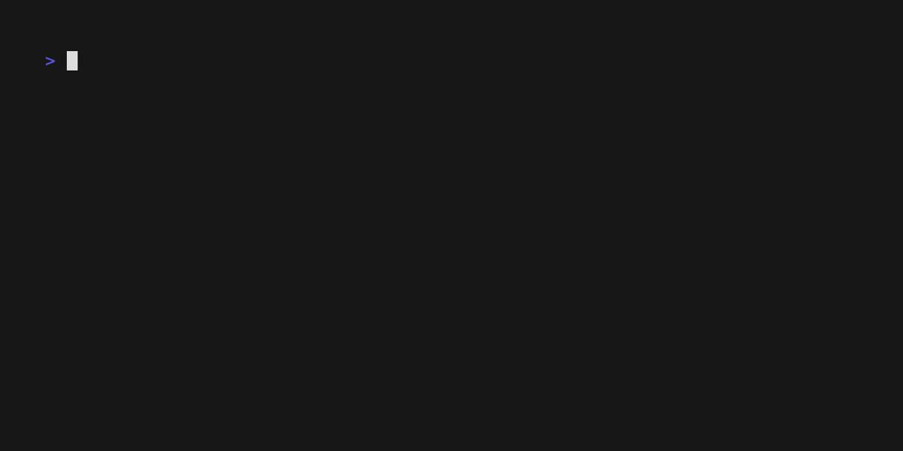

# driftlint

[](https://www.npmjs.com/package/@alifurkangokce/driftlint) [](https://github.com/alifurkangokce/driftlint/actions/workflows/ci.yml) [](LICENSE)

**Your CLAUDE.md is lying to your agent.** driftlint keeps agent context files true, two ways: a **drift linter** that finds the claims in `CLAUDE.md`, `AGENTS.md`, skills, subagents and cursor rules that your code no longer supports — and **Reviewed Memory**, the missing approval layer between what your agents learn and what your team ships into CLAUDE.md.

```bash
npx @alifurkangokce/driftlint
```



Zero config. No API key. Works on any repo.

## Why

Coding agents trust context files completely. But code moves and context files don't: the file you renamed in March is still "the entry point" in CLAUDE.md, the `deploy:prod` script you deleted is still the documented release path, and the skill you wrote last month is silently invisible because your skill descriptions overflowed the system-prompt budget.

Agent knowledge decays like code documentation always has — except now the reader can't tell something is off. It just follows the instructions.

The research backs this up: an [ETH Zurich evaluation](https://arxiv.org/abs/2601.20404) measured that auto-generated context files *reduce* agent success while minimal human-written ones help — so the winning move is keeping the human-written file true, not generating a new one. And a 2026 study of 247k instruction lifetimes (["Why Does CLAUDE.md Keep Growing?"](https://arxiv.org/abs/2608.11095)) found context files gain ~5 instructions per commit and almost never shrink, because once a rule's rationale is lost nobody dares delete it — which is why every Reviewed Memory entry carries its evidence and provenance.

## Reviewed Memory (beta)

Agents keep relearning the same repo facts, and pasting them into CLAUDE.md by hand doesn't scale to a team. Reviewed Memory closes the loop:

```bash
driftlint memory propose --text "Auth goes through the BFF." --evidence src/auth.ts:42   # the AGENT does this
driftlint memory review    # the HUMAN approves/rejects, one entry at a time
driftlint memory sync      # approved set → a marked block in CLAUDE.md / AGENTS.md / GEMINI.md
```

Why it works: the synced block lives in the files **every agent CLI already reads** (no hooks, no daemon), git distributes it via ordinary PRs, and driftlint scans `.agent-memory/` and the block itself — so when the code moves, the memory that references it gets flagged like any other drift. Claude Code users get a `/memory-propose` command with the plugin. The propose → human-review → commit flow aligns with the governance channel of the [memorywire](https://arxiv.org/pdf/2606.01138) vendor-neutral memory wire format.

### Auto-memory audit

Claude Code also keeps its own [auto memory](https://code.claude.com/docs/en/memory) per project (`~/.claude/projects/<project>/memory/`) — and those memories decay exactly like context files, except they live *outside* the repo where no repo-scoped linter ever looks:

```bash
driftlint memory audit        # finds the memory dir for the current repo automatically
```

It verifies every memory against the repo it describes: **dead paths and removed commands** referenced in memories, **broken `[[wiki-links]]`** between memories (resolved via filenames *and* frontmatter `name:` slugs), and a **MEMORY.md past the 200-line / 25KB fold** — everything below it silently never loads into a session. Memories that record facts about *other* repos are recognized and collapsed into one info line instead of a flood.

## Twins: CLAUDE.md ↔ AGENTS.md

The most-upvoted request on the Claude Code tracker — [support AGENTS.md, 5,200+ 👍](https://github.com/anthropics/claude-code/issues/6235) — is marked *not planned*. So teams using Claude Code next to Codex/Amp/Cursor keep **both** files, and the copies drift: someone fixes the test command in CLAUDE.md, AGENTS.md goes stale, and a week later half the team's agents follow the outdated copy. driftlint attacks this twice:

```bash
driftlint                  # the twin-drift rule flags pairs that already diverged
driftlint twins            # mirror AGENTS.md into CLAUDE.md as a marked, idempotent block
driftlint twins --check    # CI mode: fail when the mirror is stale
```

The `twin-drift` rule stays quiet for intentionally different files — it fires only on evidence: near-identical files with divergent lines, command claims that exist in one file but not the other, or a stale `driftlint twins` mirror. Pairs bridged with an `@AGENTS.md` import are recognized and skipped.

## What it checks

| Rule | What it catches |
|---|---|
| `dead-path` | Referenced files/dirs that no longer exist — with "did you mean `src/util.ts`?" hints when the file moved |
| `dead-command` | `npm run` scripts and `make` targets that were removed or renamed |
| `skill-budget` | Skill descriptions overflowing the ~15k-char system-prompt budget — skills past it are **silently invisible** to the agent |
| `stale-knowledge` | Context files untouched for months while the code they describe churned heavily |
| `foreign-context` | A file whose references mostly don't resolve — probably describes another repo; findings collapse into one warning instead of a flood |
| `narrative-claim` | *(only with `--llm`)* Narrative claims ("auth goes through the BFF") that the code contradicts — verified with your own Anthropic API credentials |
| `template-context` | Workflow files that describe a project this repo *generates* — collapsed into one warning instead of a flood |
| `load-budget` | Content that silently never reaches the model: AGENTS.md past Codex's 32 KB truncation limit, files past the ~150-instruction adherence ceiling |
| `missing-rationale` | Directive walls (never/always/must) with no stated reason — [the rules nobody dares delete](https://arxiv.org/abs/2608.11095) |
| `twin-drift` | CLAUDE.md and AGENTS.md that carry the same instructions but diverged — differing command claims, drifted near-copies, stale `driftlint twins` mirrors |
| `untracked-context` | Context files git doesn't track — your agent follows them, your teammates' agents never see them (`CLAUDE.local.md` is exempt by convention) |

`dead-command` is workspace-aware: a script that exists in another monorepo package is reported as a *location* warning ("defined in `packages/client/package.json`"), not a dead command.

## Usage

```bash
npx @alifurkangokce/driftlint                 # scan the current repo
npx @alifurkangokce/driftlint path/to/repo    # scan another repo
npx @alifurkangokce/driftlint --fix           # interactively apply safe fixes (--yes: all)
npx @alifurkangokce/driftlint --json          # machine-readable output (CI-friendly)
npx @alifurkangokce/driftlint --sarif         # SARIF 2.1.0 for GitHub code scanning
npx @alifurkangokce/driftlint --no-fail       # report but always exit 0
npx @alifurkangokce/driftlint --diff          # only drift THIS change caused (vs origin/main)
```

`--diff` is what you want on pull requests: it scans the merge-base in a temporary worktree, reports only findings that are **new**, and attributes them to the change — *"this PR renames `src/auth.ts` → `src/authn.ts`; CLAUDE.md still references the old path"* — with the fix derived from the rename. Pre-existing drift stays out of your PR.

Installed globally (`npm i -g @alifurkangokce/driftlint`) the command is just `driftlint`.

Exit code is `1` when errors are found, so it drops straight into CI. Or use the action:

```yaml
# .github/workflows/driftlint.yml
on: [pull_request]
permissions:
  security-events: write   # only needed when sarif-file is set
jobs:
  driftlint:
    runs-on: ubuntu-latest
    steps:
      - uses: actions/checkout@v4
        with: { fetch-depth: 0 }   # full history enables the staleness check
      - uses: alifurkangokce/driftlint@main
        with:
          diff: "true"                  # PRs: only report drift this PR caused
          sarif-file: driftlint.sarif   # optional: findings become PR annotations
```

Or as a [pre-commit](https://pre-commit.com) hook:

```yaml
repos:
  - repo: https://github.com/alifurkangokce/driftlint
    rev: v0.7.0
    hooks:
      - id: driftlint
```

### Optional LLM pass

Deterministic checks can't see narrative claims. `--llm` extracts them from your context files, greps the repo for evidence, and asks Claude whether the code contradicts them:

```bash
npm install @anthropic-ai/sdk        # optional peer dependency, only needed for --llm
export ANTHROPIC_API_KEY=sk-ant-...  # or `ant auth login`
npx @alifurkangokce/driftlint --llm
npx @alifurkangokce/driftlint --llm --llm-model claude-haiku-4-5   # budget option
```

Your key, your bill (default model `claude-opus-5`; capped at 10 files / 8 claims per file, token usage is printed). Findings are warnings marked *needs review* — the verifier is conservative: missing evidence is "unverifiable", never "contradicted". **Without `--llm`, driftlint never touches the network.**

### reviewdog: one-click "Apply suggestion" on PRs

```yaml
      - run: npx -y @alifurkangokce/driftlint --rdjsonl --no-fail | reviewdog -f=rdjsonl -reporter=github-pr-review -filter-mode=nofilter
```

`--rdjsonl` emits reviewdog RDFormat where every did-you-mean fix becomes a committable GitHub suggestion. `-filter-mode=nofilter` matters: drift findings live on lines the diff never touched.

### MCP server: agents lint their own context

```bash
claude mcp add driftlint -- npx -y @alifurkangokce/driftlint-mcp
```

Two tools from [`@alifurkangokce/driftlint-mcp`](mcp/): `drift_scan` (full report, optional `diff_range`) and `drift_check` — an agent about to edit CLAUDE.md verifies the reference **before** writing it, so it never writes a dead one.

### Freshness badge

Every scan computes a deterministic **context-freshness score** (the share of path references that resolve; collapsed template/foreign files excluded). Put it in your README:

```yaml
      - uses: alifurkangokce/driftlint@main
        with: { badge-json: badge.json, fail: "false" }
      - uses: Schneegans/dynamic-badges-action@v1.7.0
        with:
          auth: ${{ secrets.GIST_SECRET }}
          gistID: <your-gist-id>
          filename: driftlint.json
          contentFile: badge.json
```

```markdown

```

### Adopting on a legacy repo

```bash
npx @alifurkangokce/driftlint --update-baseline   # record today's findings
```

This writes `.driftlint-baseline.json`; from then on only **new** drift is reported, so CI stays green while you pay down the backlog.

### Config

Optional `.driftlintrc.json` at the repo root:

```json
{
  "skillBudget": 15000,
  "ignore": ["docs/archive/**"],
  "templates": [".claude/skills/**"],
  "rules": { "dead-command": "off", "stale-knowledge": "info" }
}
```

### Template repos (scaffolds, methodology kits)

If your repo *generates* other projects, its skills legitimately reference files that will exist in the **generated** project — driftlint would report those as dead. Three escapes: put a `driftlint-template` comment in the file, list globs under `"templates"` in `.driftlintrc.json` (both skip path/command checks with one info note), or let the auto-heuristic handle it — a skill/agent/command file with ≥2 unresolved references *and* generator vocabulary ("scaffolds", "will create", "your project") collapses into a single `template-context` warning. Root `CLAUDE.md`/`AGENTS.md` are **never** auto-suppressed: they describe *this* repo.

Suppress a single false positive with a comment on the same line or the line above:

```markdown
<!-- driftlint-ignore -->
This mentions `hypothetical/example.ts` on purpose.
```

## Scanned files

`CLAUDE.md`, `CLAUDE.local.md`, `AGENTS.md`, `GEMINI.md` (anywhere in the tree), `.claude/skills/*/SKILL.md`, `.claude/agents/*.md`, `.claude/commands/*.md`, `.cursor/rules/*`, `.github/copilot-instructions.md`, `.windsurfrules`, `.clinerules` (file or directory), `.opencode/{agent,command,knowledge}/**.md`.

## Claude Code plugin

driftlint also ships as a Claude Code plugin: a `/driftlint` command that runs the scan and then **fixes** the drift it finds (with your approval).

```
/plugin marketplace add alifurkangokce/driftlint
/plugin install driftlint@driftlint
```

## How driftlint compares

| | **driftlint** | agnix | ctxlint / agents-lint | claude-mem etc. |
|---|---|---|---|---|
| Checks context files against the **actual codebase** (dead paths, dead commands, staleness) | ✅ | ❌ structural rules only | ✅ | ❌ |
| PR-first: baseline mode, SARIF annotations, workspace-aware commands | ✅ | partial | partial | ❌ |
| Template-repo awareness (scaffold kits don't drown you in noise) | ✅ | ❌ | ❌ | ❌ |
| **Reviewed team memory** (agent proposes → human approves → synced & re-verified) | ✅ | ❌ | ❌ | ❌ auto-capture, no review |
| Structural/spec rules, LSP, IDE plugins | ❌ by design | ✅ 448 rules | partial | ❌ |

driftlint and [agnix](https://github.com/agent-sh/agnix) are complements, not rivals — agnix checks that your context files are *well-formed*; driftlint checks that they're *still true*. Run both, like eslint and tsc.

## Roadmap

See [ROADMAP.md](ROADMAP.md) — next up: an **optional LLM pass** for narrative claims, then **Reviewed Memory**: agents *propose* knowledge at session end, humans approve via PR, git distributes it, and driftlint keeps it honest.

## License

MIT
